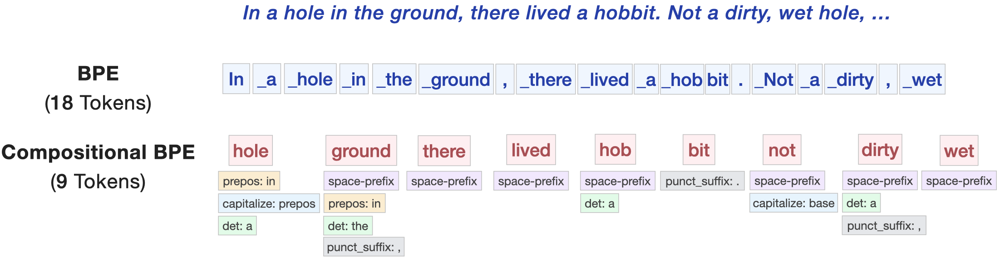

# CoBPE: More Than Words

**[More Than Words: Compositional Tokenization for Efficient Language Models](https://arxiv.org/abs/2610.05597)**<br>
Yuval Reif, Guy Kaplan, and Roy Schwartz · The Hebrew University of Jerusalem<br>
COLM 2026

[Paper](https://arxiv.org/abs/2610.05597) · [Project website](https://co-bpe.github.io) · [OpenReview](https://openreview.net/forum?id=Yw16kddexd) · [Citation](#citation)

CoBPE represents text as **lexical base tokens with reusable surface modifiers**.
A phrase such as “On the table.” can occupy one sequence position: the base
`table` carries modifiers for the preposition, determiner, capitalization, and
punctuation. The model adds modifier embeddings to the base embedding at input
and predicts the base and its modifiers at output.



*The paper's main example: recurring surface structure becomes part of the token
representation, shortening the sequence while preserving the text.*

In the [paper's experiments](https://arxiv.org/abs/2610.05597), CoBPE achieves:

- **30% fewer sequence positions** than standard BPE.
- **+1.2 and +1.3 points** on the 30-task downstream average at 780M and 1.3B
  parameters, respectively, under matched training compute.
- **1.28× faster inference** in controlled text-copying experiments and
  **18.6% less training time** to reach the nanochat speedrun capability target.

This is the official implementation, including tokenizer training and
finalization, the native Rust runtime, and language-model training and
evaluation. See the [project website](https://co-bpe.github.io) for a visual
method overview and more details.

## Quick start

Install [uv](https://docs.astral.sh/uv/) and a current stable
[Rust toolchain](https://rustup.rs/) (`rustc` and `cargo`). On macOS, also
install the command-line developer tools with `xcode-select --install`; on
Linux, install your distribution's C/C++ build tools. Run the following
commands from the repository root. `uv` manages Python and builds the Rust
extension automatically; there is no separate Cargo or maturin install step.

For an NVIDIA GPU with a driver compatible with the CUDA 12.8 PyTorch wheels:

```bash
uv sync --locked --extra gpu
```

For CPU-only development or evaluation:

```bash
uv sync --locked --extra cpu
```

Check the installation before downloading any data:

```bash
uv run --locked --extra cpu python -m cobpe check-install
```

For the GPU environment, replace `--extra cpu` with `--extra gpu`. The check
uses a temporary byte tokenizer, verifies a Unicode roundtrip through the
native CoBPE runtime, runs a tiny CPU model forward/backward pass, and reports
CUDA availability. It requires no datasets or pretrained checkpoints.

Add `--group dev` to either command to install the development tools. The CPU
profile can also be used on macOS. CPU and GPU profiles are mutually exclusive.

## Reproduce the experiments

Follow [docs/reproduce.md](docs/reproduce.md) to configure local parquet data,
train and finalize the tokenizers, and run the paper's BPE and CoBPE models.
The guide includes local commands and Slurm recipes for the matched-compute
experiments and nanochat speedrun comparison.

CoBPE defaults to `--modifier-head gated-refinement` with per-group gates.
The simple alternatives are `lexical-bias` and `gated-concat`. See the
[modifier-head documentation](docs/modifier_base_conditioned_head.md) for the
architecture and objective.

## Commands

The `cobpe` command groups the user-facing workflows:

| Command | Purpose |
| --- | --- |
| `python -m cobpe check-install` | Verify native runtime and a tiny model without data downloads |
| `python -m cobpe train-tokenizer` | Train BPE, normalized BPE, or SuperBPE |
| `python -m cobpe finalize-tokenizer` | Build CoBPE metadata and finalize its vocabulary |
| `python -m cobpe inspect-tokenizer` | Preview tokenization and modifiers |
| `python -m cobpe evaluate-tokenizer` | Measure compression and roundtrip fidelity |
| `python -m cobpe train` / `evaluate` | Train or evaluate a language model |
| `python -m cobpe generate` | Generate text from a checkpoint |

To generate text from a checkpoint, pass the exact
tokenizer used for training:

```bash
uv run python -m cobpe generate \
  --prompt "A short story begins" \
  --model-tag cobpe_vanilla_d24 \
  --tokenizer-dir "$TOKENIZER_COBPE_DIR" \
  --output-base-dir "$DATA_BASE_DIR/runs/vanilla/d24"
```

## Native tokenizer

The external `rustbpe` package trains the BPE vocabulary. Our separate Rust
extension uses `tiktoken-rs` for BPE encoding and implements CoBPE composition
and reconstruction. Both are installed automatically by `uv sync`.
See [docs/native_runtime.md](docs/native_runtime.md) for the runtime structure
and development commands.

## Repository layout

- `cobpe/` contains framework-neutral tokenization and modeling interfaces.
- `cobpe/decomposition/` contains the Python metadata builder and its
  reference tokenizer helpers.
- `nanochat/` contains the training backend used by the paper experiments.
- `scripts/` contains tokenizer training, model training, and evaluation entry
  points.
- `rust_ext/compositional_runtime/` contains the Rust tokenizer runtime.
- `slurm/paper/` contains the paper's tokenizer, training, and evaluation jobs.
- `tests/` contains regression tests for the tokenization and model interfaces.

The Rust runtime includes code derived from Andrej Karpathy's nanochat project;
see [THIRD_PARTY_NOTICES.md](THIRD_PARTY_NOTICES.md) for attribution and license
details.

## Citation

If you use CoBPE in your research, please cite:

```bibtex
@inproceedings{reif2026more,
  title={More Than Words: Compositional Tokenization for Efficient Language Models},
  author={Yuval Reif and Guy Kaplan and Roy Schwartz},
  booktitle={Third Conference on Language Modeling},
  year={2026},
  url={https://openreview.net/forum?id=Yw16kddexd}
}
```

Citation metadata is also available in [CITATION.cff](CITATION.cff) and
[citation.bib](citation.bib).

## License

CoBPE is released under [Apache-2.0](LICENSE). See
[THIRD_PARTY_NOTICES.md](THIRD_PARTY_NOTICES.md) for upstream licenses and notices.
